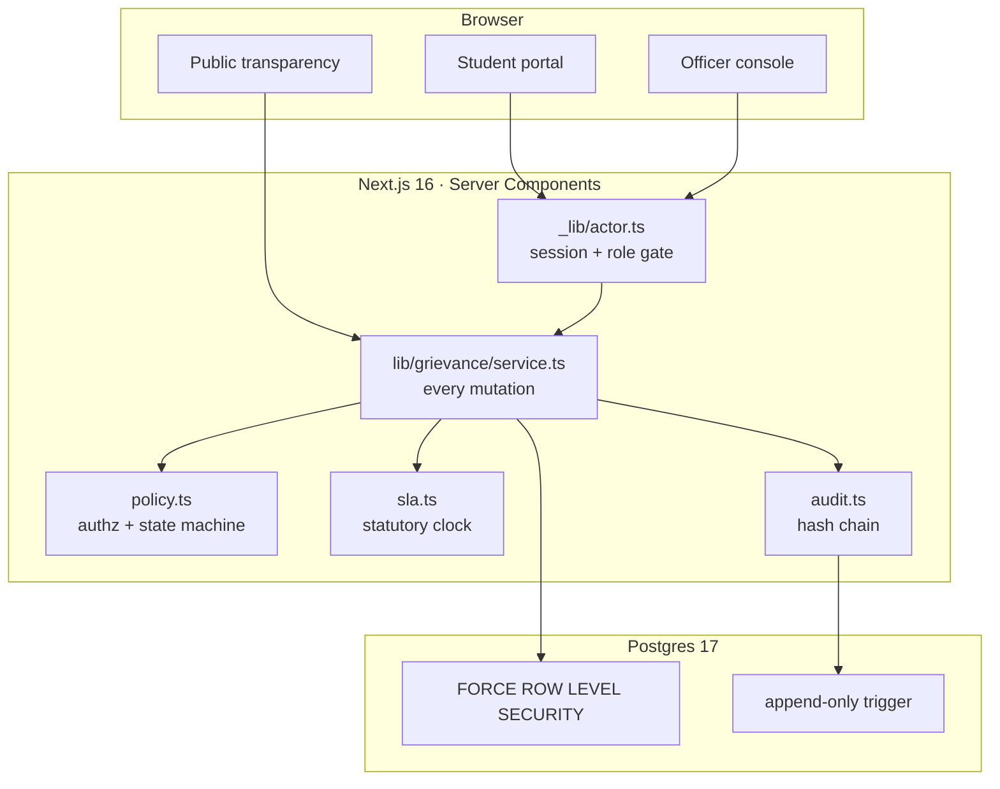

<div align="center">


### Shikayat likhne se kuch nahi hota. Unless someone is holding a clock.

In 2019, four of us at MANIT Bhopal wrote an SRS promising three things: campus **I**nformation,
campus **N**ews, and student **C**omplaints. We shipped one of them, and even that one was a
complaint-box template downloaded off the internet whose categories still said *E-commerce*,
*Online Shopping* and *E-wallet*. Nobody ever changed them. Seven years later I came back and
finished the idea properly: a statutory grievance system an Indian institution can put in front of
a UGC inspector, with a clock on every case and a record nobody can quietly edit.

[](https://github.com/darkpandawarrior/SINC-P/actions/workflows/ci.yml)


[](LICENSE)

**[Why](#why-sinc-p)** · **[Highlights](#highlights)** · **[What changed](#what-changed-since-2019)** · **[Screens](#screens)** · **[Architecture](#architecture)** · **[Getting started](#getting-started)** · **[Prove it](#prove-it-yourself)** · **[Honesty](#whats-real-and-what-isnt-honestly)**

**Portfolio:** [cv-siddharth.vercel.app](https://cv-siddharth.vercel.app/) &nbsp;·&nbsp; **Origin:** final-year project, MANIT Bhopal, 2019 &nbsp;·&nbsp; **Siblings:** [Mileway](https://github.com/darkpandawarrior/Mileway) · [PaymentsLab](https://github.com/darkpandawarrior/PaymentsLab) · [Kursi](https://github.com/darkpandawarrior/Kursi)

</div>

---

<details>
<summary><b>Table of contents</b></summary>

- [Why SINC-P](#why-sinc-p)
- [Highlights](#highlights)
- [What changed since 2019](#what-changed-since-2019)
- [The three pillars, and their honest depth](#the-three-pillars-and-their-honest-depth)
- [Screens](#screens)
- [Architecture](#architecture)
  - [Tenancy, in four layers](#tenancy-in-four-layers)
  - [The audit chain](#the-audit-chain)
  - [The statutory clock](#the-statutory-clock)
  - [Module map](#module-map)
- [Tech stack](#tech-stack)
- [Getting started](#getting-started)
- [Prove it yourself](#prove-it-yourself)
- [Three bugs that only running the thing found](#three-bugs-that-only-running-the-thing-found)
- [What's real and what isn't, honestly](#whats-real-and-what-isnt-honestly)
- [Migrating a real 2019 deployment](#migrating-a-real-2019-deployment)
- [Testing and quality](#testing-and-quality)
- [Security posture](#security-posture)
- [Commercial material](#commercial-material)
- [Roadmap](#roadmap)
- [Credits](#credits)

</details>

> **At a glance.** **25 routes** across five role-scoped areas · **10 tables**, every tenant row
> under `FORCE ROW LEVEL SECURITY` · **215 tests** at 73% coverage ·
> a hash-chained audit trail re-verified on every seed run · **one command** that proves tenant
> isolation actually fires instead of asking you to believe it.

## Why SINC-P

Every campus already has a complaints channel. It is an email address, and it is a black hole.
You send your hostel water problem into it, and the only feedback loop is whether the water comes
back. Nobody can tell you if anyone read it, who owns it now, or whether the fifteen day window
the UGC gives them has already run out.

That window is the whole product. The UGC (Redressal of Grievances of Students) Regulations, 2023
require every institution to run a Student Grievance Redressal Committee, resolve inside a
statutory clock, and offer an Ombudsperson appeal tier. NAAC and NBA visits ask to see the
records. What most colleges actually have is a spreadsheet, maintained by whoever was free, and a
spreadsheet cannot prove a response time to an inspection committee.

So the buyer is not a student. It is the Registrar or the Dean of Student Welfare, the budget line
is accreditation readiness, and the competitor is Excel.

I did not decide that alone. The product question went to a council of seven independent model
families (deepseek, kimi, glm, gpt, llama, qwen, mistral), each asked to rule and to disagree
where they genuinely differed. Six of seven picked compliance over the alternatives for the same
reason: it is the only wedge where the buyer pays out of obligation rather than enthusiasm. The
full ruling, the dissents, and the two places where I overruled the majority are in
[**ADR-0001**](docs/decisions/0001-product-and-architecture.md), with the raw transcript beside it.

The dissent that changed the build came from deepseek, and it was the sharpest thing anyone said:

> Compliance is the *budget line*, not the product. Without student-side pull the complaints
> channel stays empty and the compliance record is a fiction.

Which is correct, and slightly brutal. A grievance register nobody files into produces a beautiful
audit export of zero rows. So the system publishes its own closure times, anonymised, without a
login, at [`/transparency`](#screens). Students can see that Ragging and Harassment cases close in
a median of 4 days while Transport takes 12. That number is the reason anyone files. The Registrar
buys the audit trail; the students show up for the scoreboard.

## Highlights

- ⏱️ **A statutory clock that survives an audit.** Every grievance carries a `dueAt` computed from
  the category override or the institution default, in Asia/Kolkata, in calendar or working days.
  The timezone handling is deliberate: IST sits at a fixed +5:30, so a due date computed off UTC
  calendar days lands a day early or late depending on what time somebody filed, and you find out
  during an inspection. Breaches escalate officer → admin → Ombudsperson.
- 🔗 **An append-only trail that shows its teeth.** `grievance_events` is hash-chained, each event
  committing to the one before it. A retro-edited remark or a deleted escalation breaks
  verification at a nameable sequence number. Enforced by a `BEFORE UPDATE OR DELETE` trigger and
  a `REVOKE`, not by good intentions. (The UI says *tamper-evident, not tamper-proof*, because
  that is the honest claim and overselling it would be the one lie an auditor could catch.)
- 🏛️ **Tenant isolation you can attack.** Four independent layers, on the assumption any one of
  them will eventually have a bug: application scoping, transaction-local tenant context,
  `FORCE ROW LEVEL SECURITY`, and a runtime role that is neither owner nor superuser.
  `./docs/verification/run.sh` stands up a throwaway Postgres and tries to break all of it.
- 📊 **Published closure times, with the small cells suppressed.** Any figure computed from fewer
  than five grievances renders as `—`, enforced in the query layer rather than the view, because
  enforcing it in the view is how it eventually leaks. In one department a count of one is a name.
- 🧾 **The escalation ladder the 2019 SRS actually described.** Student files, moderator screens
  and routes, redressal officer resolves, Ombudsperson hears appeals. The original code had two
  copy-pasted folders called `admin/` and `Director/` and no escalation at all.
- 🔐 **scrypt instead of `md5()`.** N=2¹⁶, per-password salt, parameters stored with the hash so
  they can be raised later without locking anybody out. The 2019 table stored bare unsalted md5,
  which means every password in it was recoverable in about the time it takes to read this bullet.
- 📎 **Uploads that cannot become a shell.** Magic-byte sniffing rather than trusting the declared
  type, a size cap enforced while streaming rather than after buffering, opaque storage keys
  outside the web root, and authorisation re-checked on every download. The 2019 version wrote
  `$_FILES` straight into a web-served folder under the user's own filename.
- 📬 **A transactional outbox, not fire-and-forget email.** A queued message is written in
  the same transaction as the thing that caused it, so a rolled-back status change cannot
  tell a student their case moved. Delivery happens out of band, which keeps SMTP latency
  and SMTP outages out of the request path entirely.
- 🧪 **Tests that skip instead of screaming.** 47 of the 194 talk to a real Postgres on purpose,
  because RLS and database triggers cannot be meaningfully mocked. Without a database they skip
  with a message telling you which command to run, so a fresh clone never looks broken.
- 🇮🇳 **Built for the actual buyer.** AISHE code on the institution record, Asia/Kolkata clocks,
  a category tree that starts at Hostel and Mess, and a sensitive-category flag that gives Ragging
  and Harassment a shorter SLA and a bypass around triage.
- 🗃️ **A migration path for the real thing.** `scripts/import-legacy.ts` reads a genuine 2019
  `cms.sql` dump, replays every remark into a valid hash chain, and verifies each chain *before*
  writing it. It refuses to carry the md5 hashes across.

## What changed since 2019

The entire 2019 tree is gone. Nothing was ported: not the code, not the schema, not the passwords.
That sounds dramatic for a college project, and it is worth being specific about why, because
almost every line below is an ordinary mistake that is still running at institutions today.

| 2019 | 2026 | What was actually wrong |
|---|---|---|
| `mysqli_query($con, "SELECT * FROM users WHERE userEmail='".$_POST['username']."'")` | Parameterised queries with RLS underneath | **Unauthenticated SQL injection.** Typing `' OR '1'='1' -- ` into the login box logged you in as the first user in the table. Every single query was built by string concatenation. |
| `md5($_POST['password'])`, no salt | scrypt, N=2¹⁶, per-password salt | **Instantly reversible.** Identical passwords produced identical hashes, so one dump told you which students shared a password. |
| `admin/` copy-pasted to `Director/` | One console, one role enum, one `policy.ts` | Forty duplicated files that drifted apart. The SRS described an escalation ladder. The code implemented two identical dashboards. |
| `complaint-details.php?cid=5` | `canView(actor, grievance)` on every read path | **IDOR.** Any logged-in student read every other student's grievances by counting upwards. There was no ownership check anywhere. |
| `move_uploaded_file($_FILES["compfile"]["tmp_name"], "complaintdocs/".$name)` | Sniffed, capped, opaque, outside the web root | **Remote code execution by upload.** Upload `shell.php`, request `shell.php`, own the server. |
| `complaintremark`, editable in place | Append-only hash-chained `grievance_events` | An officer could rewrite a past remark and claim it always said that. In a compliance product that is the entire ballgame. |
| `status varchar(50)`, `NULL` meaning pending | A real state machine with an explicit transition matrix | The dashboard had to query `WHERE status is null`. No transition was ever illegal, so a closed grievance could silently reopen. |
| Reset by matching email **and phone number** | Single-use hashed token, 30 minute expiry | **Account takeover by anyone who knew your phone number.** There was no token at all. |
| Categories: `E-commerce`, `Online Shopping`, `E-wallet` | A real campus tree with per-category SLA overrides | The clearest tell of all. The taxonomy was never adapted, because the app was a template. |
| `error_reporting(0)` | Errors surface in dev, structured logging in prod | Silencing errors does not remove them. It removes your ability to see them. |

The full accounting, including how a real deployment's data migrates across, is in
[**docs/migration-from-2019.md**](docs/migration-from-2019.md).

## The three pillars, and their honest depth

The council voted to cut pillars 1 and 2 outright and ship only the grievance engine. I overrode
that, partially, because finishing the original vision was the entire point of coming back. But I
scoped them hard so they cannot quietly turn into a CMS project.

| Pillar | 2019 | 2026 | Depth |
|---|---|---|---|
| **Complaints** | shipped, as a template | The product. SLA engine, role ladder, hash chain, compliance reporting. | Production |
| **Information** | never built | Statutory disclosures (SGRC composition, Ombudsperson, procedure) plus a deflection handbook. UGC mandates *publishing* these, so it is a compliance artefact rather than a CMS. | Real, narrow |
| **News** | never built | An announcements surface with channels and pinning. | Deliberately thin |

Roughly a third of what lands in a campus complaint box is a question with a documented answer,
which is why the handbook exists and why the filing form surfaces matching entries before it
accepts anything. Deflection is a feature, not a shortcut.

## Screens

> **These are not committed yet, and I would rather say so than ship a README with broken image
> links.** `npm run db:seed` builds 200 grievances across two institutions with realistic ages,
> statuses and breach states, so every screen has genuine shape to photograph. It is the top item
> on the [roadmap](#roadmap).

What you will see when you run it:

**The officer queue** sorts by what breaches soonest, never by newest, because "newest first" is
how a case ages quietly into a violation. Filters on status, category, assignee and SLA state,
with bulk assign and move.

**The case view** renders the full hash-chained trail as a timeline, with internal remarks visually
distinct from student-visible ones so nobody guesses wrong about who can read what. The action
panel offers only the transitions `canSetStatus` actually permits for that actor, so the UI never
shows a button the server will reject.

**The compliance dashboard** is the screen that gets screenshotted into a NAAC self-study report:
median resolution by category, breach counts, ageing buckets, appeal rate, CSV export and a print
stylesheet that produces a clean A4 page.

**The student portal** shows where a grievance actually is and what happens next, with the
statutory deadline in plain language, and the option to withdraw, accept, or appeal.

## Architecture

Next.js 16 App Router, Server Components throughout. No client-side data fetching anywhere. Every
page calls the service layer, the service layer is the only thing that touches the database, and
the database does not trust the service layer either.



### Tenancy, in four layers

Multi-tenant on one shared Postgres. Four layers, because any single one of them will eventually
have a bug and the cost of getting this wrong is the kind that ends a B2B product.

1. **Application scoping.** Every tenant query goes through `withTenant(institutionId, …)`.
2. **Transaction-local context.** `set_config('app.institution_id', …, true)`. That third argument
   is load-bearing. With `false` a pooled connection hands the next request the previous tenant.
3. **`FORCE ROW LEVEL SECURITY`** on all ten tables, so the policy binds the table owner too.
4. **A restricted runtime role.** `sincp_app` is `rolsuper = f`, `rolbypassrls = f`.

Cross-tenant access exists (the login lookup has to find a user before it knows their institution)
and it runs as a **different role on a separate pool**. Bypass is a property of the connection you
open, never of a setting the application can write. That distinction is not academic. It is
[bug #1 below](#three-bugs-that-only-running-the-thing-found).

### The audit chain

```
hash(n) = sha256( prevHash ‖ grievanceId ‖ seq ‖ type ‖ actorId ‖ remark ‖ payload ‖ createdAt )
```

Fields join with `U+001F`. Join them with nothing and `("ab","c")` hashes identically to
`("a","bc")`, which is a forgery primitive rather than a style nit, so there is a test for exactly
that case. Payload keys are sorted, because `JSON.stringify` follows insertion order and two
semantically identical payloads would otherwise produce different hashes and break a chain for no
reason.

Every mutation writes its event inside the same transaction as the state change. If the event
write fails, the state change rolls back. That atomicity is the compliance claim: there is no way
to change a grievance without leaving a link in the chain.

### The statutory clock

`due_soon` fires inside 20% of the window remaining, or 3 days, whichever is larger. A 30 day
Ombudsperson window therefore still warns with real time left, while a 5 day sensitive-category
override does not warn on day one. Both the queue filter and the row badge read that same
function, which they did not always do (see [bug #2](#three-bugs-that-only-running-the-thing-found)).

### Module map

```
src/
  db/schema.ts          10 tables; every tenant row carries institutionId
  db/client.ts          withTenant(), the only door into tenant data
  lib/grievance/
    policy.ts           authorisation and the state machine, in one file on purpose
    audit.ts            the hash chain
    sla.ts              statutory clock, Asia/Kolkata, calendar or working days
    service.ts          every mutation, each writing its event in the same transaction
  lib/auth/             scrypt, server sessions, CSRF, rate limiting
  app/(public)          landing · transparency · disclosures · status lookup
  app/(student)/my      file · track · withdraw · accept · appeal
  app/(staff)/staff     queue · case view · compliance dashboard
  app/(admin)/admin     users · categories · settings · security log
  app/(campus)          news · handbook
  proxy.ts              mints the CSRF cookie
drizzle/0001_rls.sql    policies, roles, append-only trigger
scripts/
  seed.ts               demo data that verifies its own chains and tenant scoping
  import-legacy.ts      imports a real 2019 cms.sql dump
  check-rls.mjs         asserts RLS is actually switched on
```

That file is `proxy.ts`, not `middleware.ts`, and the reason is worth knowing: **Next 16 renamed
the convention.** A file called `middleware.ts` is silently never invoked. No warning, no error.
It presents as "CSRF fails on every form" with absolutely nothing in the logs, which cost me a
confused twenty minutes until I read the version's own docs instead of trusting what I already
knew.

## Tech stack

| Layer | Choice | Why this one |
|---|---|---|
| Framework | Next.js 16, App Router | Server Components mean the authorisation check and the query live on the same side of the wire |
| UI | React 19, Tailwind 4 (CSS-first `@theme`) | No `tailwind.config.js` in v4; tokens live in `globals.css` |
| Language | TypeScript strict, `noUncheckedIndexedAccess` | Catches the `rows[0]` that is actually `undefined` |
| Data | Drizzle ORM, Postgres 17 | Real SQL, real RLS, and migrations you can read |
| Auth | scrypt from `node:crypto`, server sessions | No dependency to keep patched, and it survives an air-gapped campus deployment |
| Validation | Zod v4 at every boundary | |
| Tests | Vitest, real Postgres for the integration half | |
| Deploy | Docker Compose, one command, behind their nginx | The buyer's IT admin is a lecturer on rotation |

## Getting started

```bash
cp .env.example .env.local
npm install
npm run db:up            # Postgres 17 in Docker
npm run db:push          # schema, then RLS policies, then asserts they are on
npm run db:seed          # 2 institutions · 20 users · 200 grievances · 911 events
npm run dev
```

Then <http://localhost:3000>. Every seeded account shares the password the seed prints at the end.

| Try | Account |
|---|---|
| The student view | `aarav.sharma@rit-bhopal.sincp.demo` |
| Triage queue | `anjali.rao@rit-bhopal.sincp.demo` (moderator) |
| Officer console | `suresh.iyer@rit-bhopal.sincp.demo` |
| Appeals | `ramesh.chandran@rit-bhopal.sincp.demo` (ombudsperson) |
| Users, categories, settings | `meera.joshi@rit-bhopal.sincp.demo` |

The seed builds **two** institutions on purpose. Cross-tenant isolation should be something you
can try to break, not something you have to take my word for.

## Prove it yourself

```bash
./docs/verification/run.sh
```

Stands up a throwaway Postgres, applies the schema and the policies, and runs eight checks:
per-tenant visibility, fail-closed with no tenant context set, IDOR by explicit UUID, the
privileged-role escape hatch, and append-only enforcement against both `UPDATE` and `DELETE`.
Method and results: [**docs/verification/tenant-isolation.md**](docs/verification/tenant-isolation.md).

The append-only checks deliberately run **as the table owner**. Running them as the unprivileged
role proves nothing, because the `REVOKE` stops the statement before the trigger is ever reached.
The first version of that suite made exactly that mistake and got a confident, meaningless pass.

## Three bugs that only running the thing found

Every one of these read correctly, reviewed fine, and was wrong. I am documenting them because the
pattern matters more than the individual defects: **verify that a guard fires, not that it is
configured.**

**1. The RLS bypass could grant itself.** The policy keyed off `current_setting('app.bypass_rls')`.
Any role can write its own settings. So the application role could run
`SELECT set_config('app.bypass_rls','on',true)` and read every institution in the database. One
statement. The entire argument for having RLS is defence against an application bug, and I had
built a bypass reachable from the application. It now keys off `pg_has_role(...)`, which
`sincp_app` cannot grant itself, and the identical attack returns zero rows.

**2. `drizzle-kit push` silently disables RLS and drops every policy.** It recreates tables to
apply schema changes, and the flags and policies do not survive that. Nothing errors. Nothing
looks broken afterwards, because application-level scoping still filters correctly and every page
renders the right rows. Measured across one push: `relrowsecurity` true → false, policies 1 → 0.
`npm run db:push` now chains `db:rls` and `db:check-rls`, so a push cannot leave the database
undefended.

**3. Login was completely broken under RLS, and I demoed it working anyway.** `sessions` is a
tenant table, but `session.ts` queried it with the unscoped client, so `createSession` hit
`new row violates row-level security policy`. It went unnoticed for an embarrassing reason: I had
demonstrated login working *while RLS was accidentally switched off by bug #2*, then re-enabled
RLS and never retested. A working demo on a database with its security layer disabled. An
adversarial review caught it by reading the policy; I confirmed it by actually running the login.

If you take one thing from this repository, take that. Reading code tells you what it is supposed
to do. Only running it tells you what it does.

## What's real and what isn't, honestly

- **Grievance lifecycle end to end** (file, triage, assign, remark, resolve, close, withdraw,
  appeal). Real, covered by tests, and driven through the browser during development.
- **Tenant isolation, the audit chain, the append-only trigger.** Real, and verified firing against
  a live Postgres 17, not asserted. See [Prove it yourself](#prove-it-yourself).
- **The SLA engine.** Real, including working-day mode and the Asia/Kolkata handling, with an
  hour-by-hour sweep test asserting the badge and the queue filter agree across an entire window.
- **The legacy importer.** Real, and verified against the genuine 2019 `cms.sql` (22 complaints,
  5 remarks). Not run against a production deployment, because there isn't one.
- **News and handbook.** Real and working, deliberately shallow. No scheduling, no revisions,
  no workflow.
- **Attachments.** Real storage, sniffing, caps and authorisation. Local disk driver only. S3 is
  a documented seam, not an implementation.
- **Notifications.** Real. Filing, assignment and status changes queue a message in a
  transactional outbox, drained by `npm run notify:send`. Two transports ship: stdout for
  development, and a small SMTP client written directly against `node:net`/`node:tls`
  rather than pulling in a mail library to say `MAIL FROM`. Delivery is at-least-once
  with a dedupe key, five attempts, then dead-lettered. Not yet run against a real relay.
- **SSO: not built.** There is a seam for OIDC, nothing behind it.
- **Malware scanning on uploads: not built.**
- **Rate limiting.** Real, but in-process memory. Correct for one node, insufficient behind a
  load balancer.
- **Screenshots in this README: not captured yet.**
- **A paying customer, or a pilot, or a design partner: none.** This is the artefact you take
  to the first Registrar conversation, not evidence that the conversation went well.

## Migrating a real 2019 deployment

```bash
npm run db:import-legacy -- --sql ./cms.sql --institution <uuid>            # dry run
npm run db:import-legacy -- --sql ./cms.sql --institution <uuid> --commit
```

Three refusals worth defending:

**md5 hashes are not migrated.** Carrying them across would import the vulnerability along with
the data. Every imported user arrives deactivated and must reset. This makes go-live day noisy and
it is still the right answer.

**No SLA is back-dated.** An imported grievance gets `dueAt = null` rather than an invented
deadline. Fabricating a statutory due date for something filed in 2018 would inject fictional
breaches into the very first compliance report, which is the precise opposite of the point.

**An unrecognised status becomes `submitted` rather than being dropped.** Misfiling a grievance is
recoverable. Losing one is not.

> The parser passed every test I wrote against synthetic SQL, then failed the moment I pointed it
> at the real dump: genuine data contains `complaintType = ' Complaint'` with a leading space, and
> my `.trim()` was quietly rewriting imported records. Test against the artefact you actually
> have, not the tidy one you invented.

## Testing and quality

```bash
npm test              # 215 tests
npm run typecheck     # strict, noUncheckedIndexedAccess
npm run db:check-rls  # asserts RLS is enabled, forced, and policied
```

Most run anywhere. About a quarter talk to a real Postgres deliberately, because RLS, the
append-only trigger and cross-tenant behaviour are database behaviour and a mock of them would
assert nothing at all. Without a database those suites **skip with a message naming the command to
run**, so a fresh clone never greets you with five red files.

Worth calling out: the illegal-transition matrix, a student trying to act on another student's
grievance, chain integrity across a full lifecycle, the concurrent-append retry, small-cell
suppression, magic-byte rejection, path traversal, and a sweep that walks an entire SLA window
hour by hour asserting the badge agrees with the queue filter.

## Security posture

Full threat model, the verified evidence, and **eight named open gaps** in
[**docs/security.md**](docs/security.md). A security document that lists no gaps is not a credible
one, so: no malware scanning, in-memory rate limiting, no SSO, no field-level encryption at rest,
no MFA, pool-reuse tenant inheritance argued rather than directly tested, no dependency scanning
in CI, and undefined attachment retention.

## Commercial material

[`docs/gtm/`](docs/gtm/) carries the parts that are not code: ICP and positioning, pricing
(₹75,000 scoped pilot rising to ₹1.5L to ₹3L a year, priced per institution and never per
grievance, because per-grievance pricing pays a college to suppress filings), a 90 day launch plan
with explicit kill criteria, a pilot proposal a Registrar could actually sign, and straight
answers to the ten objections that will genuinely come up.

## Roadmap

- [ ] Screenshots and a flow GIF for this README
- [ ] Run the SMTP transport against a real college relay
- [ ] Malware scanning before an upload becomes downloadable
- [ ] Redis-backed rate limiting for multi-instance deployments
- [ ] OIDC and SAML through the existing seam
- [ ] `pgcrypto` field-level encryption on grievance bodies
- [ ] Retention and legal-hold policy for attachments
- [ ] A design-partner pilot. The highest-probability failure here was never technical.

## Credits

The 2019 original was **Siddharth Pandalai**, **Nashit Shayan Khan**, **Nalin Gupta** and **Albin
Thomas**, at MANIT Bhopal. The idea, the three pillars and the escalation ladder in the SRS are
theirs. Aage kya karoge? Turns out: this. The 2019 code has been entirely replaced, but the
project it was trying to be is what got built.

## Licence

AGPL-3.0. See [LICENSE](LICENSE).
