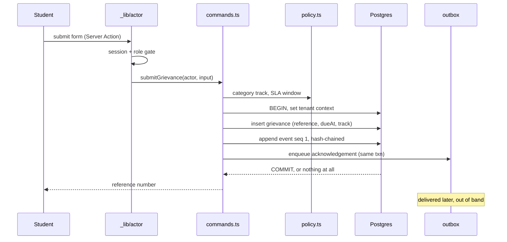

# Architecture

The README has the tour. This is the reasoning: why the boundaries sit where they do, and
what breaks if you move them.

---

## The one-sentence version

Every request runs on the server, passes a role gate, calls a service function that opens
one tenant-scoped transaction, and that transaction writes both the state change and its
audit event or neither.

Everything below is a consequence of that sentence.

---

## Layers, and what each one is allowed to know

```
route group          knows: who is signed in, and their role
  _lib/actor.ts      the gate. Every page in the group goes through it
    ↓
service layer        knows: the domain. Never reads a cookie, never renders
  commands.ts        writes. Each pairs a state change with an audit event
  queries.ts         reads. Never mutates, never appends
    ↓
policy.ts            knows: the rules. No I/O at all, which is why it is fully unit tested
sla.ts               knows: the clock
audit.ts             knows: the chain
    ↓
db/client.ts         withTenant() — the only door into tenant data
    ↓
Postgres             does not trust any of the above
```

The direction is strict. `policy.ts` cannot import the database, `service.ts` cannot
import React, and a page cannot import Drizzle. Each of those is a rule you could break in
five minutes and would regret in six months, so the import graph is the enforcement.

### Why `policy.ts` has no I/O

It is the file that decides whether a student can read another student's grievance. Pure
functions mean the whole authorisation surface is testable without a database, which is
why 27 tests cover it and why they run in milliseconds on a laptop with nothing installed.

The moment it needs a query, it stops being cheap to test exhaustively, and an
authorisation layer that is expensive to test is one that gets tested less.

### Why commands and queries are separate files

They change for different reasons. A command changes when the workflow changes: a new
transition, a new notification, a different escalation. A query changes when a screen needs
a different shape. Those are different people on different days, and they were previously
the same 1021-line file.

---

## The four properties worth protecting

Everything else is negotiable. These are not.

### 1. Tenant isolation

Four layers, because any one of them will eventually have a bug:

1. `withTenant()` scoping in the application
2. Transaction-local tenant context (`set_config(..., true)`)
3. `FORCE ROW LEVEL SECURITY` on all eleven tenant tables
4. A runtime role that is neither owner nor superuser

The layering is the point. Layer 1 fails the first time someone writes a raw query. Layer 3
fails if a policy is dropped, which [happens on every `drizzle-kit push`](security.md).
Layer 4 is what makes layers 2 and 3 unbypassable from application code.

**The failure mode to understand:** a per-record check does not protect a list endpoint.
`canView` guards a record you already hold; a list query never holds one, it builds a
`WHERE` clause. That is why `roleScopeCondition` and `accessibleTracks` exist, and why the
ICC track has integration tests that count rows rather than inspecting them.

### 2. The audit chain is atomic with the change

Every mutation appends its event inside the same transaction as the state change. If the
event write fails, the state change rolls back.

This is the whole compliance claim. A system where the record and the history are written
separately is a system where they can disagree, and the first time they disagree in front
of an auditor, everything else in the product stops being believable.

`appendEvent` uses a savepoint and retries on a `(grievance_id, seq)` collision, so
concurrent writers on one grievance serialise rather than fork the chain.

### 3. Statutory tracks gate before permissions

`sgrc`, `icc`, `anti_ragging`. The track decides who may see a case at all, before the
per-record question is asked.

The ordering matters: track first, then role, then record. Reversing it would mean a
moderator's "sees everything" branch runs before the ICC restriction, which is precisely
the bug.

### 4. Nothing automated decides an outcome

The AI suggests. The agent escalates, notifies and records. Neither can set a status.

An agent that could resolve cases would be the fastest route to a clean compliance report,
and a clean report nobody earned is the exact fraud this product exists to make difficult.
Argued in [ADR-0002](decisions/0002-ai-and-agents.md).

---

## Why Server Components throughout

The authorisation check and the query run on the same side of the wire. There is no API
surface to secure separately, no client-side data fetching to forget a guard on, and no
serialisation boundary where a masked field can be un-masked by a component that fetches
it again.

The cost is that interactivity has to be deliberate: the command palette, the login form
and the toaster are the only client components, and every form works without JavaScript.
That is not purity, it is the target deployment: students on cheap Android phones and
Registrars on old desktops, both on campus wifi.

`proxy.ts` mints the CSRF cookie because a Server Component can read cookies but cannot set
them. In Next 16 this file must be called `proxy.ts`; a `middleware.ts` is silently never
invoked.

---

## Data flow: one grievance, end to end



The notification is queued inside the transaction and delivered outside it. Sending inline
would either block the student on SMTP or email them about a transaction that rolled back.

---

## What I would change first

Honest list, in order.

1. **The ICC inquiry workflow.** Routing and confidentiality are done; statements,
   witnesses and findings are not. It is the largest remaining gap in what the product
   claims.
2. **Retention and per-student erasure.** DPDP expects both and neither exists.
3. **Attachment storage behind an interface with a second implementation.** Local disk is
   the only driver, and the S3 seam is a comment rather than code.
4. **The `institutions` singleton assumption on public pages.** `getPublicInstitution()`
   returns the first institution, which is correct for a single-tenant deployment and
   wrong the day someone hosts two colleges on one domain.

Number 4 is the one most likely to bite unexpectedly, because nothing about it fails
loudly.
