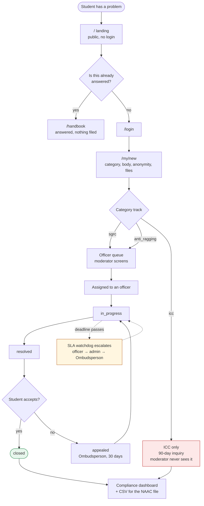
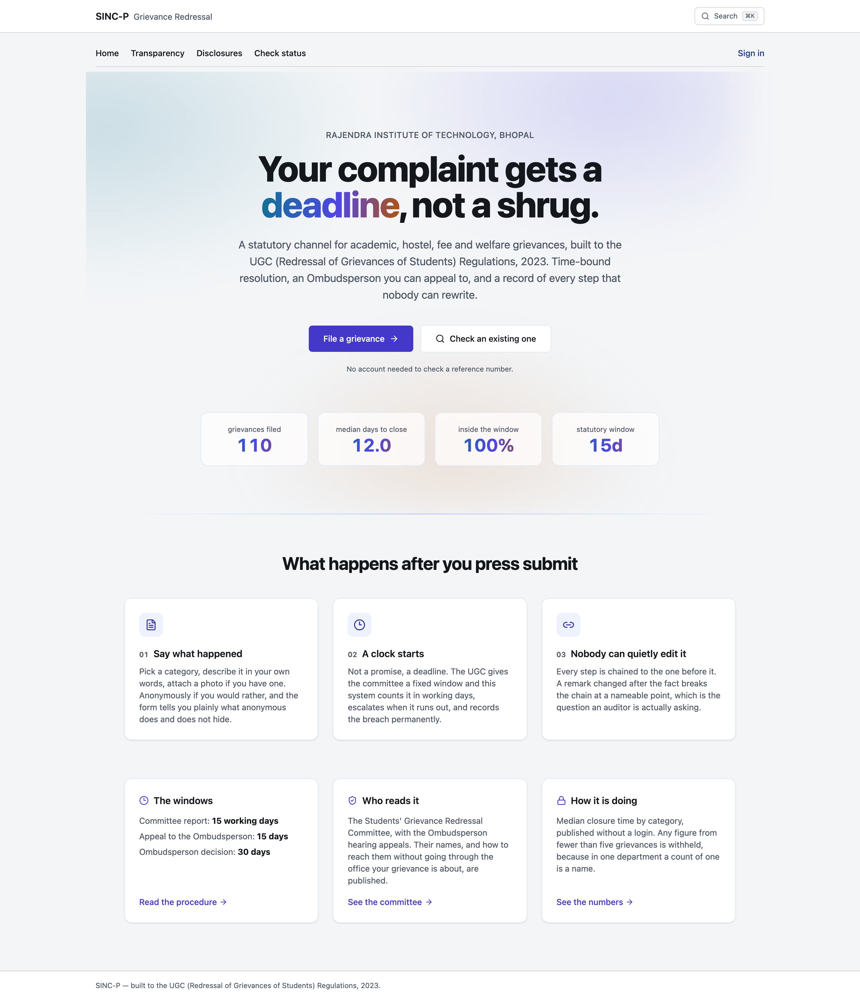
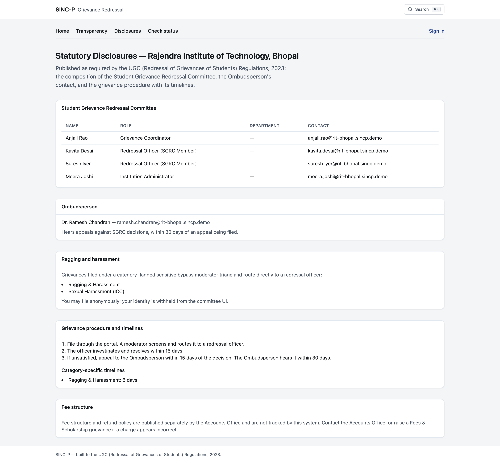
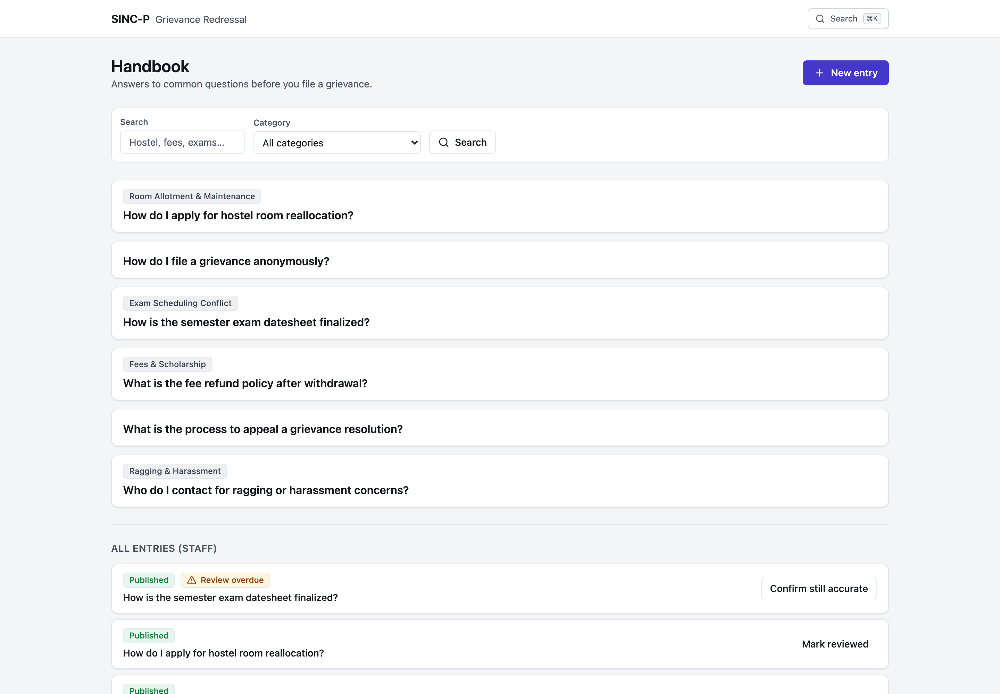
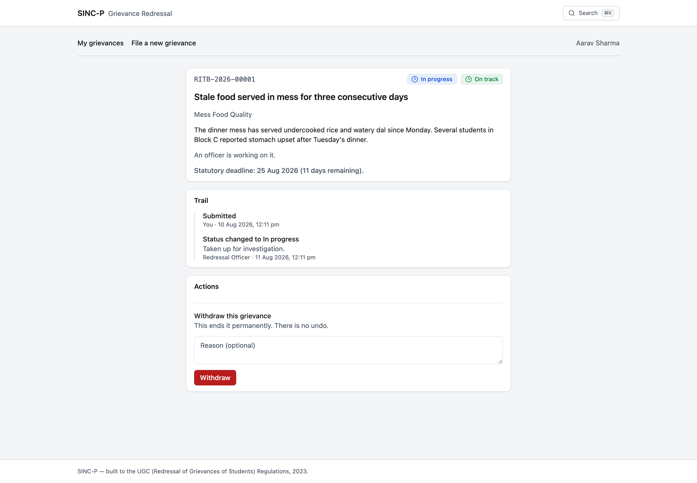
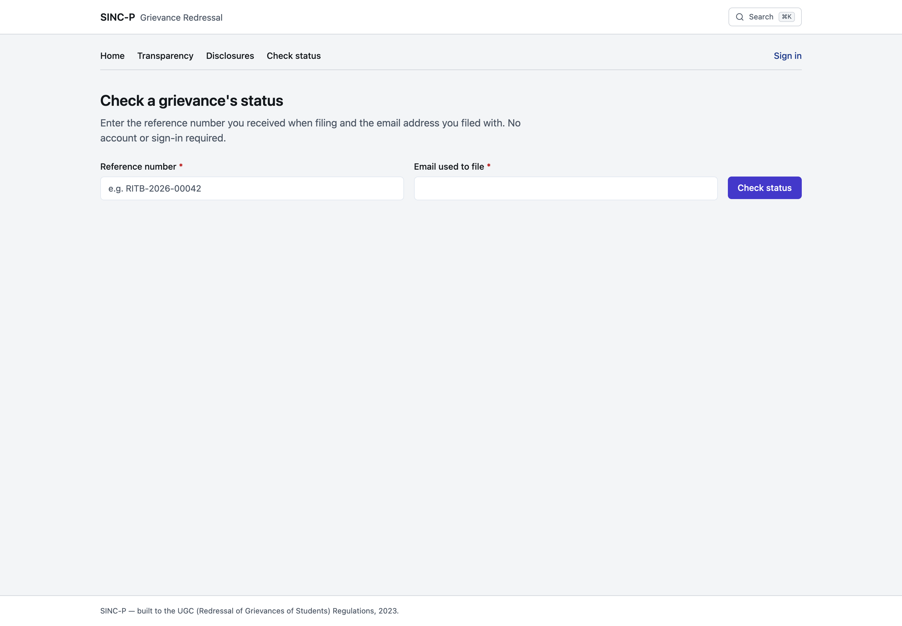
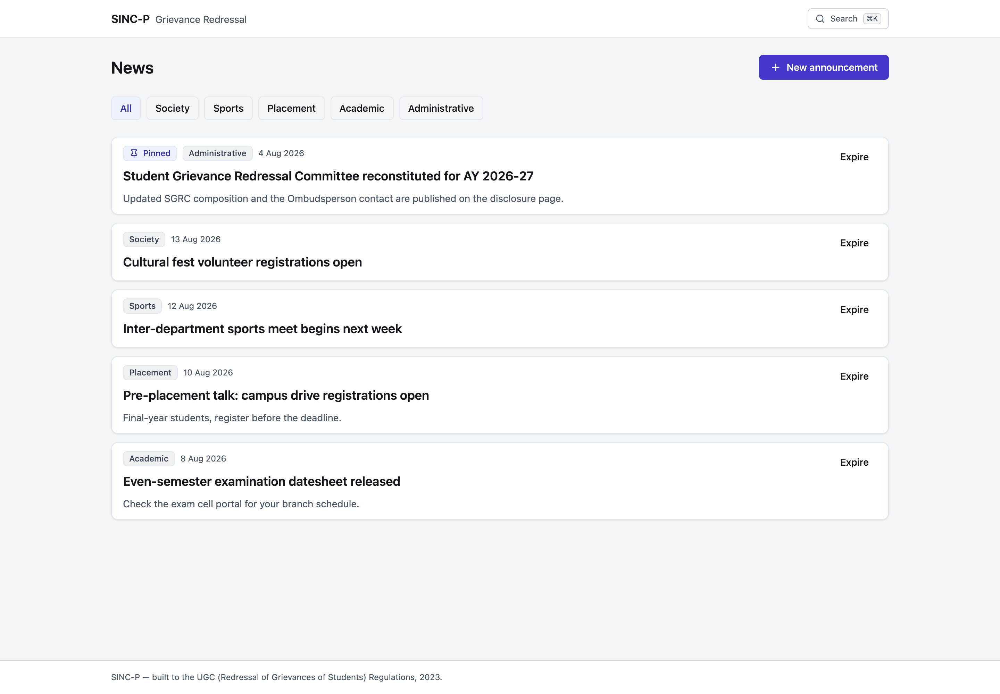

# The flow

One grievance, from the moment a student is annoyed enough to type something, to the row
an auditor reads eighteen months later. Every screen it passes through, who can see it at
each point, and what the system writes down.

---

## The whole thing at a glance



Dotted lines are things the system does on its own. Everything solid is a person deciding.

---

## Step by step

### 1. Before anything is filed

**`/` landing.** Public, no account. States the statutory windows, links the disclosures
and the transparency numbers. The numbers are live and computed from the institution's own
record, under the same small-cell suppression the transparency page uses.

**`/handbook`.** Roughly a third of what lands in a campus complaint box is a question with
a documented answer. Matching entries surface on the filing form *before* it accepts
anything, so deflection happens at the point of intent rather than after a case exists.

### 2. Filing

**`/my/new`.** Category picker driven by the institution's own tree. Anonymous toggle where
the institution allows it, with an honest explanation of what anonymous does and does not
hide. Attachments with the limits stated up front.

**What the category decides, invisibly to the student:** the statutory track, and therefore
the clock and the audience.

| Track | Clock | Who can see it |
|---|---|---|
| `sgrc` | 15 **working** days | Moderator, officers, Ombudsperson, Registrar |
| `anti_ragging` | short category override | Same, but bypasses triage |
| `icc` | 90 calendar days | **The Internal Complaints Committee only** |

**What the system writes:** the grievance row, a reference like `RITB-2026-00042`, event
`seq 1` hash-chained from genesis, and an acknowledgement queued in the outbox. All in one
transaction. If any part fails, none of it happened.

### 3. Triage

**`/staff`.** The queue sorts by what breaches soonest, never by newest, because "newest
first" is how a case ages quietly into a violation.

A moderator screens and routes. They never see an ICC case here: the track gate runs in the
`WHERE` clause, not just on the record, so those are absent from the list, from the count,
and from a category filter.

**Event:** `status_changed` to `under_review`, `visibility: internal`. The student is told
the status moved; the routing rationale stays internal.

### 4. Working the case

**`/staff/grievances/[id]`.** The trail rendered as a timeline, the SLA ring showing how
much window is left, and an action panel offering **only** the transitions
`canSetStatus` permits for this actor. The interface never shows a button the server will
refuse.

Internal remarks are visually distinct from student-visible ones, so nobody has to guess
which one they are writing.

**If the deadline passes** the watchdog escalates on its own: an `sla_breached` event with
`actorId: null` and the agent named in the payload, plus notifications to the officer, the
Registrar and the Ombudsperson. It cannot change the status. That is the whole point.

### 5. Resolution, and the student's move

The officer moves it to `resolved`. **Only the student can close it**, by accepting. An
officer closing their own case is how resolution statistics get fabricated.

**`/my/[reference]`.** The student sees the public trail, the statutory deadline in plain
language, and three choices: accept, withdraw, or appeal.

### 6. Appeal

Filing an appeal creates a **linked grievance** with `kind: 'appeal'` and `appealOfId` set,
routed to the Ombudsperson on the 30-day clock, and the Ombudsperson is notified. The
original is marked `appealed` rather than reopened, so the first decision and the appeal
are separately auditable.

### 7. The part that pays for it

**`/staff/compliance`.** Median resolution by category, breach counts, ageing buckets,
appeal rate, CSV export, and a print stylesheet that produces a clean A4 page. This is the
screen that ends up in the self-study report.

**`/transparency`.** The same institution, seen from outside and without a login.
Anonymised medians per category, any cell from fewer than five grievances withheld.

---

## What the trail looks like at the end

```
seq 1  submitted        Aarav Sharma     public    genesis → a594420128
seq 2  status_changed   Anjali Rao       internal  submitted → under_review
seq 3  assigned         Anjali Rao       internal  → Suresh Iyer
seq 4  status_changed   Suresh Iyer      public    under_review → in_progress
seq 5  sla_breached     (no actor)       public    agent: sla-watchdog, 3 days overdue
seq 6  status_changed   Suresh Iyer      public    in_progress → resolved
seq 7  status_changed   Aarav Sharma     public    resolved → closed
```

Each row commits to the one before it. Edit `seq 3`'s remark and verification breaks at
`seq 3`, which is precisely the question an auditor is asking. Delete a row and the `seq`
gap gives it away.

Tamper-**evident**, not tamper-proof. Someone with database access and the ability to
recompute can rewrite the whole chain; what they cannot do is rewrite part of it.

---

## Who sees what, in one table

| | Student (own) | Moderator | Officer | Ombudsperson | ICC member | Registrar | Public |
|---|---|---|---|---|---|---|---|
| SGRC grievance | ✅ | ✅ | assigned + unassigned | appeals | ❌ | ✅ | ❌ |
| ICC grievance | ✅ | ❌ | ❌ | ❌ | ✅ | ❌ | ❌ |
| Internal remarks | ❌ | ✅ | ✅ | ✅ | ✅ | ✅ | ❌ |
| Anonymous filer identity | self | ❌ | ❌ | ❌ | ❌ | ❌ | ❌ |
| Compliance dashboard | ❌ | ✅ (no ICC) | ❌ | ❌ | ❌ | ✅ (no ICC) | ❌ |
| Aggregated closure times | ✅ | ✅ | ✅ | ✅ | ✅ | ✅ | ✅ |

The ICC row is the one the product's confidentiality claim rests on, and it is enforced in
three places: `canView` for records, `accessibleTracks` for list queries, and again for
aggregates. Each surface that builds its own query needs the gate applied again.

---

## Screens in order

Every image below is captured from the running application against seeded data, not mocked
up. Regenerate them all with the app running: see `docs/testing.md`.

### Before filing

| | |
|---|---|
|  | **`/` landing.** Public. The statutory windows, live closure numbers, and two ways in: file, or check an existing reference. |
|  | **`/disclosures`.** What the UGC requires an institution to publish: SGRC composition, the Ombudsperson, the procedure and its timelines. |
|  | **`/transparency`.** Anonymised medians per category, no login. Cells below five grievances withheld. |
|  | **`/handbook`.** The deflection layer. A third of a complaint box is a question with a documented answer. |

### Filing and tracking

| | |
|---|---|
|  | **`/my/new`.** Category picker, anonymity toggle with an honest explanation, attachments with limits stated up front. |
|  | **`/my`.** Where each grievance actually is, and what happens next. |
|  | **`/my/[reference]`.** The public trail only, the statutory deadline in plain language, and the actions the student is actually permitted. |
|  | **`/status`.** Reference plus email, no account needed. |

### The officer's day

| | |
|---|---|
|  | **`/staff`.** Sorted by what breaches soonest, never by newest. Filters on status, category, assignee and SLA state. |
|  | **The patterns panel.** Four separate grievances, one underlying problem. Grouped by shared wording, not by a model. |
|  | **`/staff/grievances/[id]`.** The hash-chained trail, internal remarks marked, the SLA ring, and only the transitions this actor may make. |
|  | **`/news`.** The announcements surface. Deliberately thin. |

### The screen that pays for it


**`/staff/compliance`.** Filed, open, breached, appeal rate, ageing buckets and median
resolution by category, with CSV export and a print stylesheet. This is what gets
screenshotted into the self-study report.

Note what is **not** on it: the ICC category. A moderator sees no row for it, not even a
zero, because a zero still discloses that the channel exists.
